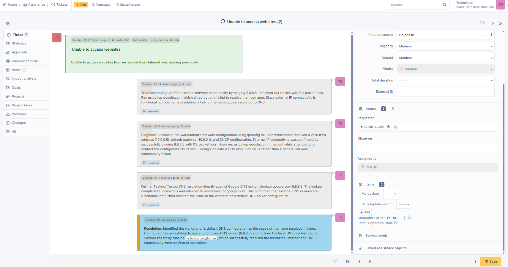
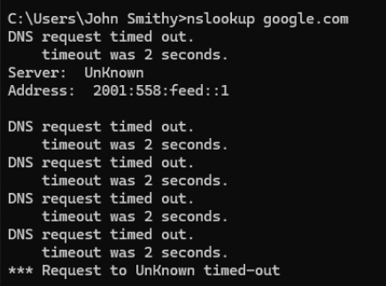
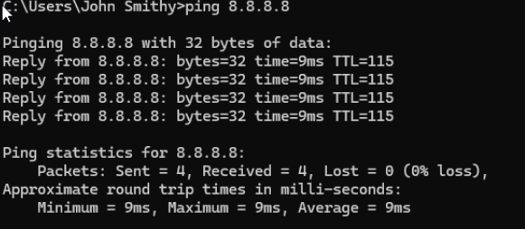
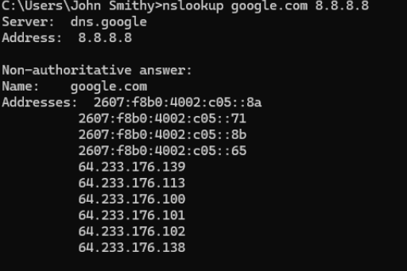
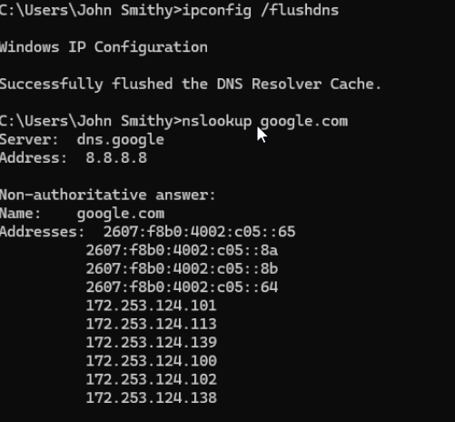

# Ticket 01 - DNS Resolution Failure

## Ticket Summary

| Field | Details |
|---|---|
| **Ticket Type** | Incident |
| **Category** | Network > DNS |
| **User** | John Smith (simulated employee) |
| **Device** | ACME-PC-001 |
| **Operating System** | Windows 11 Pro |
| **Priority** | Medium |
| **Status** | Solved |

## Problem

The user reported being unable to access websites from their Windows 11 workstation. Internet access had previously been working normally.

The objective was to determine whether the issue was caused by general network connectivity, DNS resolution, or the workstation's network configuration.

## Initial Troubleshooting

I first verified that the workstation had external IP connectivity:

```cmd
ping 8.8.8.8
```

The workstation successfully received **4/4 replies with 0% packet loss**, confirming that external IP connectivity was functioning.

I then tested hostname resolution:

```cmd
nslookup google.com
```

The DNS request timed out and the workstation was unable to resolve the hostname.

### Finding

Because the workstation could successfully communicate with an external IP address but could not resolve a domain name, the issue appeared to be related to **DNS rather than general network connectivity**.

## Network Configuration Analysis

I reviewed the workstation's network configuration:

```cmd
ipconfig /all
```

The workstation had:

- IPv4 address: `10.0.0.5`
- Default gateway: `10.0.0.1`
- DHCP enabled
- DNS servers configured

This confirmed that the workstation had received a valid network configuration and further narrowed the problem to DNS resolution.

## DNS Isolation Test

To determine whether DNS queries worked through another DNS server, I queried Google DNS directly:

```cmd
nslookup google.com 8.8.8.8
```

The lookup completed successfully and returned IP addresses for `google.com`.

### Diagnosis

This confirmed that:

- External IP connectivity was operational.
- DNS resolution worked when querying a functioning DNS server directly.
- The problem was isolated to the workstation's default DNS configuration.

## Resolution

I configured the workstation to use a functioning DNS server and then cleared the Windows DNS resolver cache:

```cmd
ipconfig /flushdns
```

I tested hostname resolution again:

```cmd
nslookup google.com
```

The lookup completed successfully using `8.8.8.8`, confirming that DNS functionality had been restored.

## Verification

After the configuration change:

- External network connectivity remained operational.
- `google.com` resolved successfully.
- DNS requests no longer timed out.
- The incident was documented and resolved in GLPI.

## Tools and Commands Used

- GLPI
- Windows 11 Pro
- GLPI Agent
- `ipconfig /all`
- `ping`
- `nslookup`
- `ipconfig /flushdns`

## Skills Demonstrated

- Help desk ticket management
- Windows network troubleshooting
- TCP/IP troubleshooting
- DNS troubleshooting
- Fault isolation
- Incident documentation
- Root cause analysis
- Resolution verification

## Troubleshooting Evidence

### 1. GLPI Incident Ticket

The incident was tracked in GLPI with troubleshooting, diagnosis, testing, and resolution documented throughout the ticket lifecycle.



### 2. DNS Resolution Failure

Running `nslookup google.com` resulted in DNS request timeouts, confirming that hostname resolution was failing.



### 3. External IP Connectivity Verification

I tested external connectivity using:

```cmd
ping 8.8.8.8
```

The workstation received 4/4 replies with 0% packet loss. This demonstrated that internet connectivity was functional even though DNS resolution was failing.



### 4. DNS Isolation Test

I queried a known DNS server directly:

```cmd
nslookup google.com 8.8.8.8
```

The query completed successfully, further isolating the problem to the workstation's default DNS configuration.



### 5. Resolution Verification

After correcting the DNS configuration and flushing the DNS resolver cache, I ran:

```cmd
nslookup google.com
```

The lookup completed successfully using `8.8.8.8`, confirming that hostname resolution had been restored.


