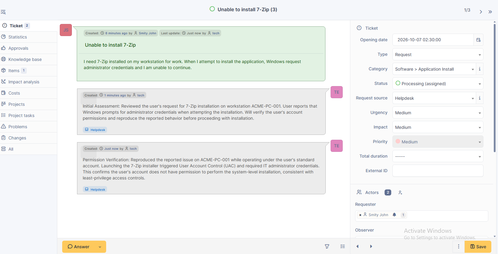
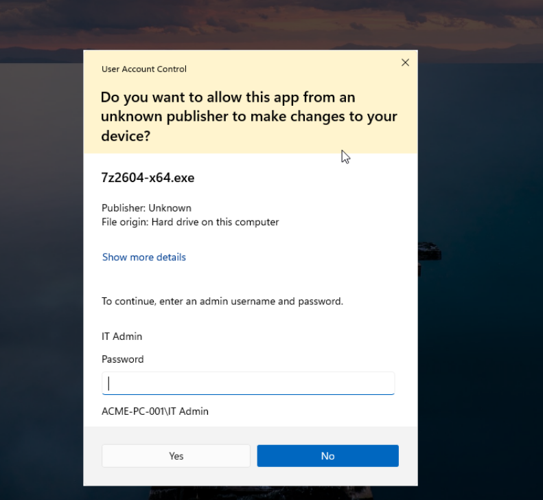
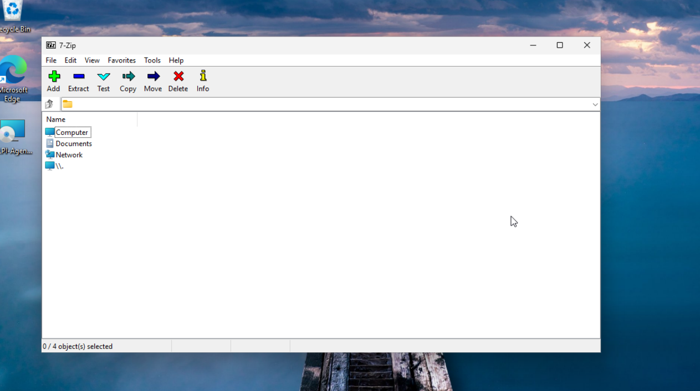
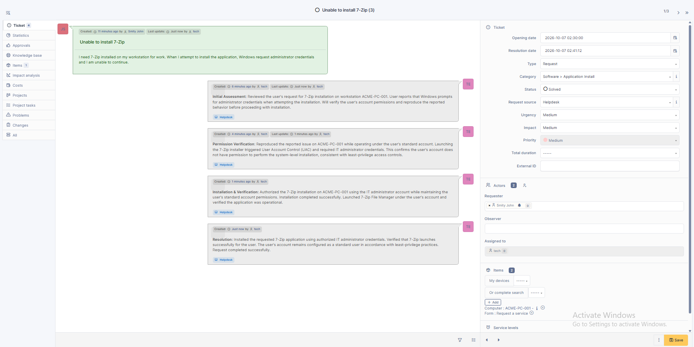

# Ticket 02 - Application Installation Request

## Overview

This ticket documents an application installation request for a standard user in a simulated help desk environment.

The user required 7-Zip on workstation ACME-PC-001 but was unable to install the application because Windows required administrator credentials.

## Environment

- Windows 11 Pro
- GLPI Help Desk
- GLPI Agent
- Standard user account
- Dedicated IT administrator account
- Workstation: ACME-PC-001

## Issue

The user submitted a request for 7-Zip installation.

When the user attempted to run the installer, Windows User Account Control (UAC) requested administrator credentials, preventing the standard user from completing the installation.

## Initial Assessment

The request was reviewed in GLPI and assigned to the help desk technician.

The reported behavior was reproduced on ACME-PC-001 using the user's standard Windows account.

## Troubleshooting and Verification

The 7-Zip installer was launched under the user's account.

Windows displayed a UAC credential prompt requiring the IT administrator account.

This confirmed that the user's standard account did not have permission to perform the system-level installation.

The behavior was consistent with least-privilege access controls rather than an application or operating system failure.

## Resolution

The installation was authorized using the dedicated IT administrator account without changing the user's account permissions.

7-Zip installed successfully on ACME-PC-001.

After installation, 7-Zip File Manager was launched under the user's standard account to verify that the application was operational.

The user's account remained a standard user.

## Skills Demonstrated

- Help desk ticket management
- Windows 11 administration
- User Account Control (UAC)
- Standard vs. administrator permissions
- Least-privilege security practices
- Application installation
- User and endpoint support
- Technical documentation
- GLPI ticket workflow

## Troubleshooting Evidence

### 1. User Request

The user submitted a GLPI request because administrator credentials were required to install 7-Zip.

### 2. Administrator Credentials Required

Running the installer from the standard user account generated a UAC prompt requiring the IT administrator account.

### 3. Successful Installation

After IT authorization, 7-Zip was installed successfully and launched under the user's account.

### 4. Ticket Resolution

The troubleshooting process, installation, verification, and resolution were documented in GLPI before the request was marked solved.

## Outcome

The requested application was successfully installed while maintaining least-privilege access controls. The user retained standard account permissions, and administrative credentials were used only to authorize the required installation.
