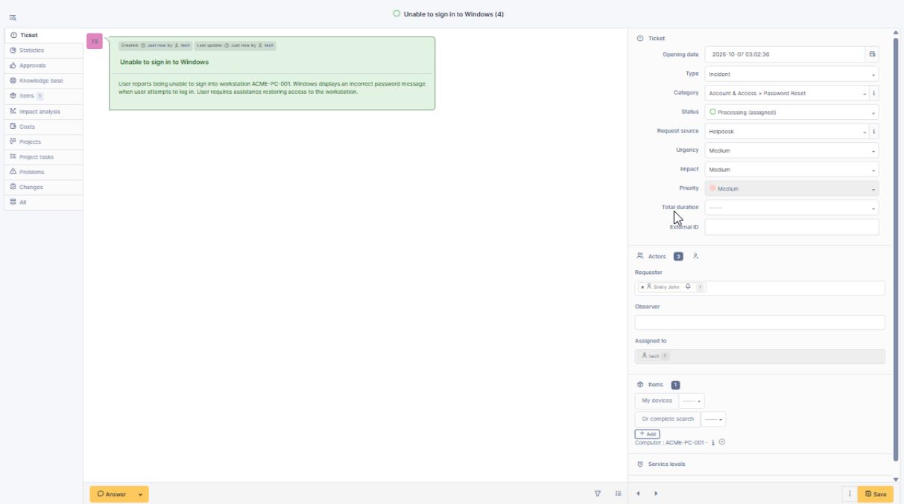
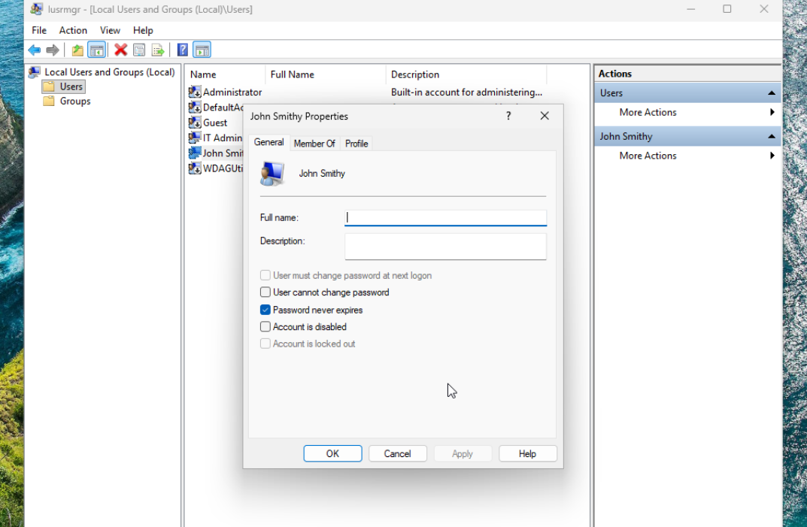
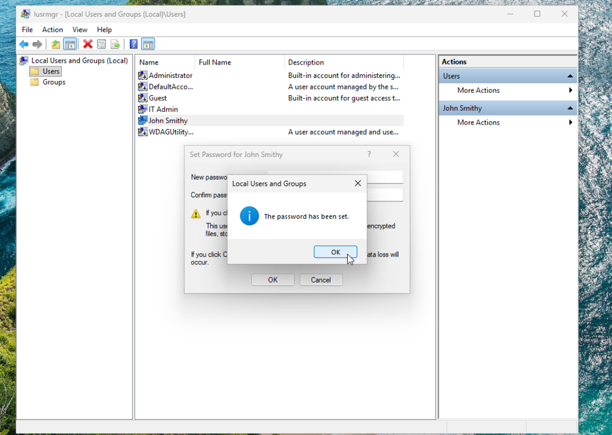
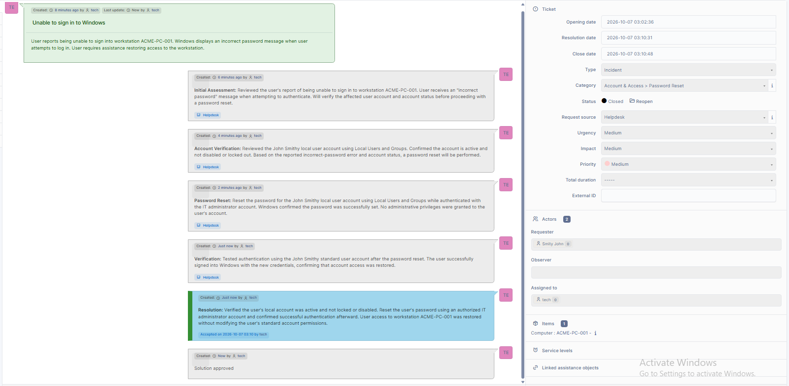

# Ticket 03 - Windows Password Reset

## Issue

A user reported being unable to sign in to workstation `ACME-PC-001`. Windows displayed an incorrect password message when the user attempted to authenticate.

## Environment

- Windows 11 Pro
- GLPI Help Desk
- Local Windows user accounts
- Standard user account
- Separate IT administrator account
- Workstation: ACME-PC-001

## Initial Assessment

The user reported being unable to sign in to workstation `ACME-PC-001`. Windows displayed an incorrect password message when the user attempted to authenticate. The issue was documented in GLPI before troubleshooting began.

## Account Verification

Using the IT administrator account, I opened Local Users and Groups and inspected the affected user account.

The account was confirmed to:

- Exist on the workstation
- Be enabled
- Not be locked out

Based on these findings and the reported incorrect-password error, a password reset was selected as the appropriate remediation.

## Password Reset

Using authorized administrator access, I reset the password for the affected local user account.

The user's account remained a standard user and was not granted administrative privileges.

Windows confirmed that the password was successfully changed.

## Verification

After completing the reset, I signed back into the affected user account using the new credentials.

Authentication completed successfully and access to the Windows desktop was restored.

## GLPI Documentation and Resolution

The troubleshooting process was documented in GLPI, including:

- Initial assessment
- Account verification
- Password reset
- Login verification
- Final resolution

The incident was then marked as resolved and closed.

## Resolution

Verified that the user's local account was active and not locked or disabled. Reset the user's password using an authorized IT administrator account and confirmed successful authentication afterward.

User access to `ACME-PC-001` was restored without modifying the user's standard account permissions.

## Skills Demonstrated

- Windows 11 troubleshooting
- Local user account administration
- Password resets
- User authentication troubleshooting
- Least-privilege administration
- GLPI ticket management
- IT asset association
- Incident documentation
- Resolution verification
