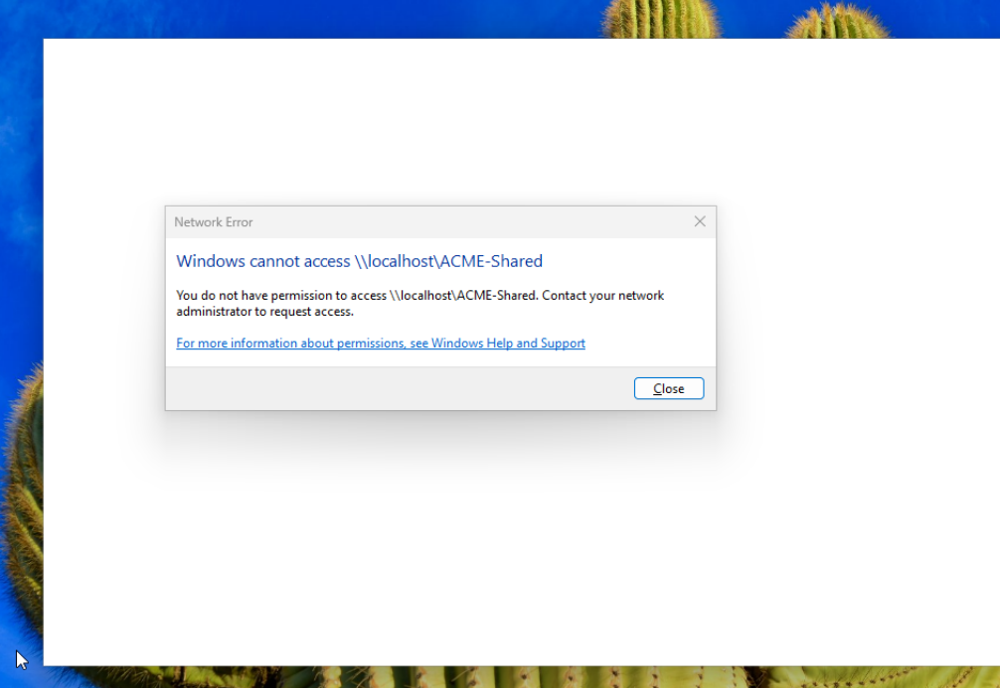
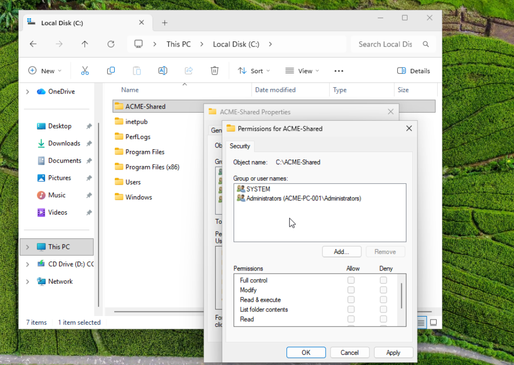
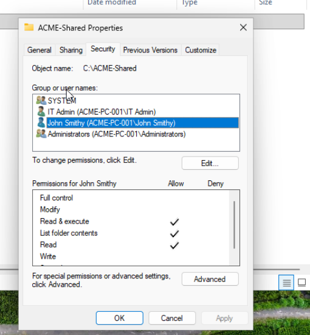
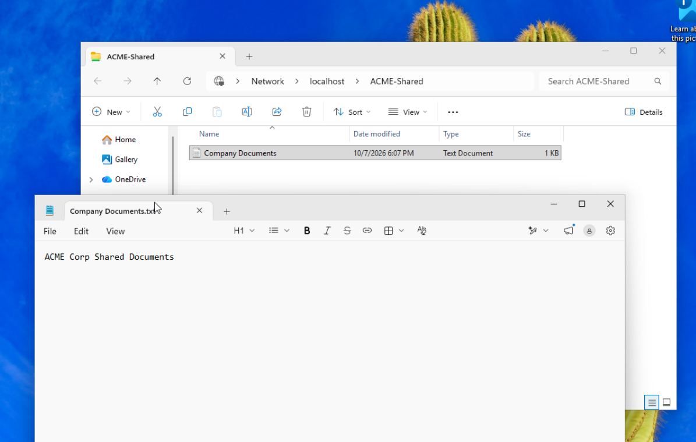
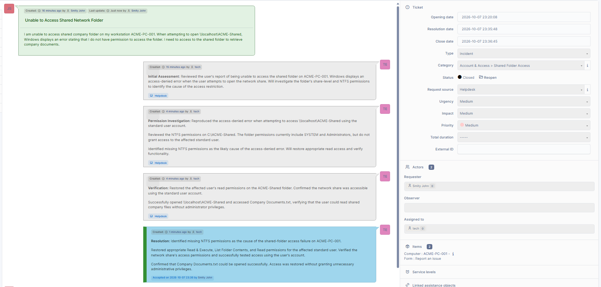

# Ticket 04 - Shared Folder Access Failure

## Issue

A user reported being unable to access the shared company folder on workstation `ACME-PC-001`.

When attempting to access `\\localhost\ACME-Shared`, Windows displayed an error stating that the user did not have permission to access the folder.



## Environment

- Windows 11 Pro
- GLPI Help Desk
- Local Windows user accounts
- Standard user account
- Separate IT administrator account
- Workstation: ACME-PC-001
- Shared folder: `C:\ACME-Shared`
- Network share: `\\localhost\ACME-Shared`

## Initial Assessment

The reported issue was reproduced while signed into the affected standard Windows user account.

Windows denied access to the shared folder, preventing the user from retrieving company documents.

The investigation focused on Windows NTFS permissions and network share permissions.

## Permission Investigation

Using the IT administrator account, I opened the folder's Properties and navigated to the Security tab.

The existing NTFS permissions were reviewed.

The folder included permissions for SYSTEM and Administrators but did not grant the affected standard user access.

This indicated that missing NTFS permissions were the likely cause of the access-denied error.



## Permission Restoration

Using the IT administrator account, I modified the folder's NTFS permissions.

The affected standard user was added and granted:

- Read & execute
- List folder contents
- Read

I also reviewed the network sharing configuration and confirmed read-level access for the affected user.

Administrative privileges and Full Control permissions were not granted.



## Verification

After restoring the appropriate permissions, I signed into the affected standard user account.

I accessed the network share using:

```cmd
\\localhost\ACME-Shared
```

The shared folder opened successfully.

I then opened `Company Documents.txt` and verified that the document was readable.

This confirmed that access had been restored without changing the user's account privileges.



## GLPI Documentation and Resolution

The incident was managed through GLPI, including:

- Initial assessment
- Access-denied reproduction
- NTFS permission investigation
- Permission restoration
- Successful access verification
- Final resolution

The solution was accepted by the requester, and the incident was closed.



## Root Cause

The affected standard user lacked the necessary NTFS permissions to access the shared folder.

Although the folder was configured for network sharing, its filesystem permissions prevented the user from accessing the shared resources.

Restoring appropriate read permissions resolved the incident.

## Skills Demonstrated

- Windows 11 troubleshooting
- NTFS permission management
- Network share configuration
- SMB file-sharing fundamentals
- Windows user account administration
- Access control troubleshooting
- Least-privilege security practices
- GLPI ticket management
- Incident documentation
- Resolution verification

## Outcome

Successfully restored access to the shared company folder by identifying and correcting missing NTFS permissions.

The user regained read access without receiving unnecessary administrative privileges.

The incident was documented and closed in GLPI.
