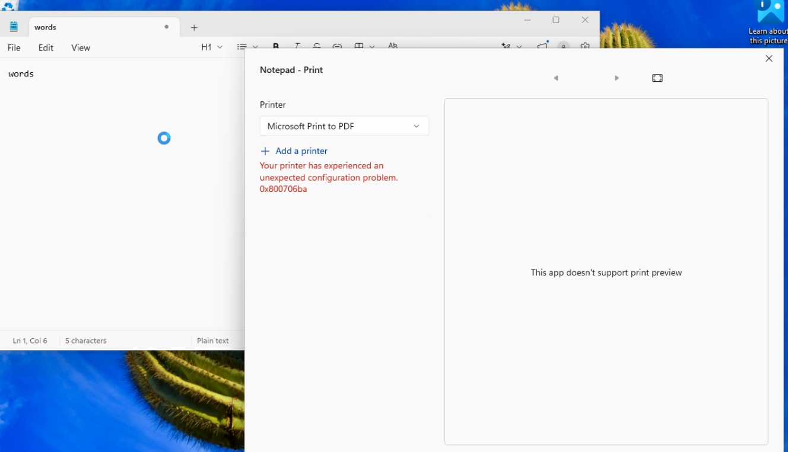
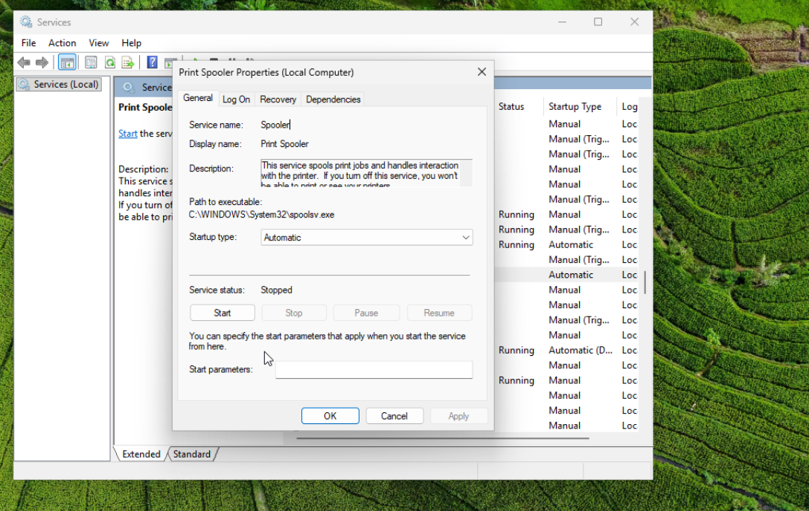
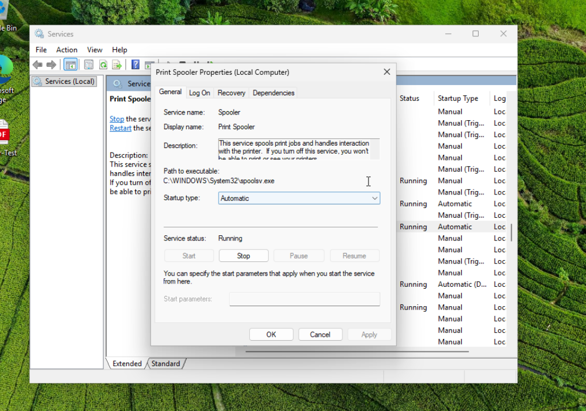
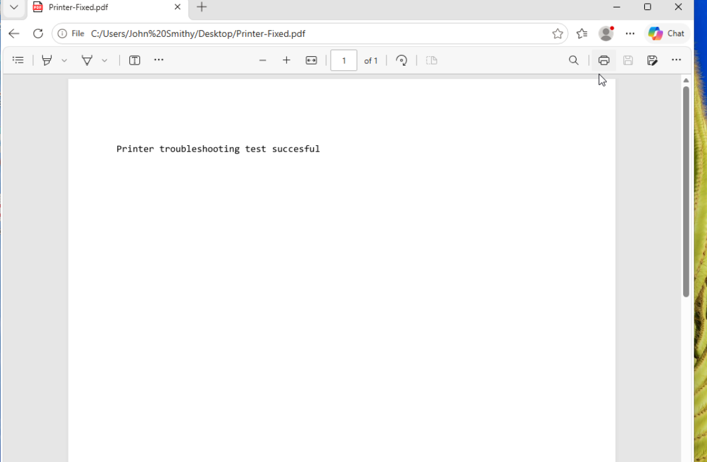
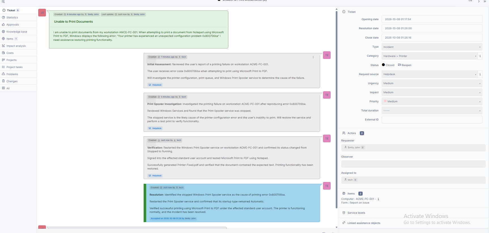

# Ticket 05 - Printer Troubleshooting

## Issue

A user reported being unable to print documents from workstation `ACME-PC-001`.

When attempting to print a document from Notepad using Microsoft Print to PDF, Windows displayed the following error:

"Your printer has experienced an unexpected configuration problem. 0x800706ba"



## Environment

- Windows 11 Pro
- GLPI Help Desk
- Standard Windows user account
- Separate IT administrator account
- Workstation: ACME-PC-001
- Printer: Microsoft Print to PDF
- Windows Print Spooler service

## Initial Assessment

The user reported a printing failure while attempting to print a document using Microsoft Print to PDF.

The issue was reproduced from the affected standard user account.

Windows displayed error code `0x800706ba`, preventing the document from being printed.

The investigation focused on Windows printer configuration and the Print Spooler service.

## Print Spooler Investigation

Using the IT administrator account, I opened Windows Services:

```cmd
services.msc
```

I located the Print Spooler service and reviewed its configuration.

The following information was observed:

- Service name: Spooler
- Startup type: Automatic
- Service status: Stopped

The stopped Print Spooler service was identified as the cause of the simulated printing failure.



## Resolution

Using Windows Services, I opened Print Spooler Properties and clicked Start.

The service successfully transitioned from Stopped to Running.

I confirmed that the Startup type remained set to Automatic.



## Verification

After restarting the Print Spooler service, I signed into the affected standard user account.

I opened Notepad and created a test document containing:

```text
Printer troubleshooting test successful
```

I selected Microsoft Print to PDF and saved the document as:

`Printer-Fixed.pdf`

The PDF was successfully generated and opened.

The document displayed the expected text, confirming that printing functionality had been restored.



## GLPI Documentation and Resolution

The incident was managed through GLPI, including:

- Initial assessment
- Printer error investigation
- Print Spooler service diagnosis
- Service restoration
- Printing verification
- Final resolution

The incident was documented in GLPI as Ticket #6.

After verifying the solution, the requester accepted the resolution and the ticket was closed.



## Root Cause

The Windows Print Spooler service was stopped.

Although the service was configured to start automatically, its stopped state prevented Microsoft Print to PDF from processing the print request.

Restarting the service restored printing functionality.

## Skills Demonstrated

- Windows 11 troubleshooting
- Printer troubleshooting
- Windows Services administration
- Print Spooler management
- Windows service diagnostics
- Microsoft Print to PDF
- Standard user support
- GLPI incident management
- Technical documentation
- Resolution verification

## Outcome

Successfully restored printing functionality by identifying and restarting the stopped Windows Print Spooler service.

Verified the repair by generating and opening a PDF document under the affected standard user account.

The incident was documented, resolved, and closed in GLPI.
