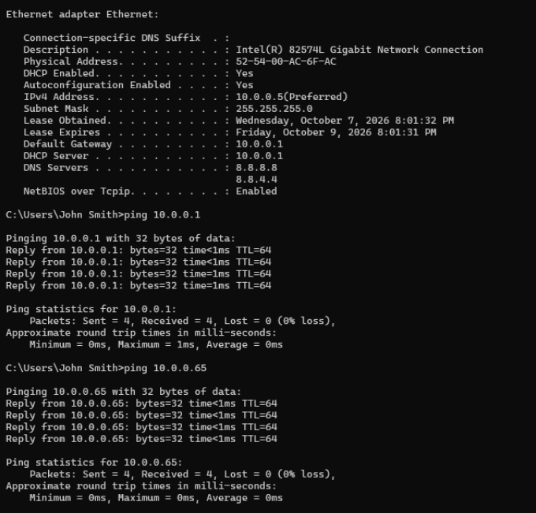
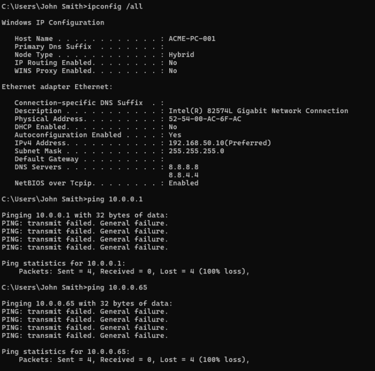
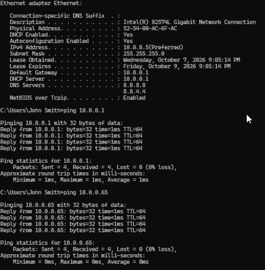
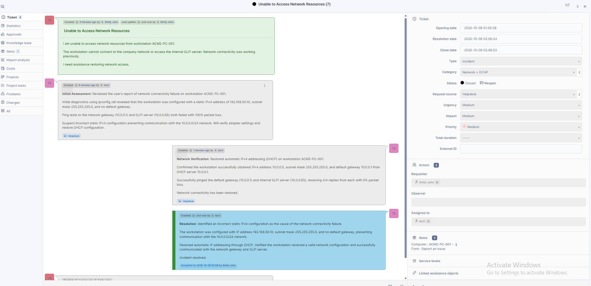

# Ticket 06 - DHCP/IP Configuration Troubleshooting

## Issue

A user reported being unable to access network resources from workstation `ACME-PC-001`, including the internal GLPI server.

The workstation's network connectivity had previously been functioning normally.

## Environment

- Windows 11 Pro
- ZimaOS virtual machine environment
- Ubuntu Server hosting GLPI
- Workstation: ACME-PC-001
- Network: 10.0.0.0/24
- Default gateway: 10.0.0.1
- GLPI server: 10.0.0.65

## Initial Network Baseline

Before introducing the simulated issue, I verified the workstation's network configuration using:

```cmd
ipconfig /all
ping 10.0.0.1
ping 10.0.0.65
```

The workstation had the following configuration:

- IPv4 address: 10.0.0.5
- Subnet mask: 255.255.255.0
- DHCP enabled: Yes
- Default gateway: 10.0.0.1

Both connectivity tests succeeded with 0% packet loss.



## Troubleshooting and Diagnosis

To simulate an incorrect network configuration, I manually configured the workstation with:

- Static IPv4 address: 192.168.50.10
- Subnet mask: 255.255.255.0
- Default gateway: None
- DHCP enabled: No

I then ran:

```cmd
ipconfig /all
ping 10.0.0.1
ping 10.0.0.65
```

Both ping tests failed with 100% packet loss.

The workstation was configured on the `192.168.50.0/24` subnet, while the gateway and GLPI server were located on the `10.0.0.0/24` subnet.

Without a default gateway, the workstation could not route traffic to those network resources.

The issue was isolated to incorrect IPv4 addressing and routing rather than DNS resolution.



## Resolution

Using the Windows Ethernet adapter properties, I changed the IPv4 configuration from a manually assigned address to:

**Obtain an IP address automatically**

This restored DHCP functionality.

The workstation successfully received:

- IPv4 address: 10.0.0.5
- Subnet mask: 255.255.255.0
- Default gateway: 10.0.0.1
- DHCP server: 10.0.0.1

## Verification

After restoring DHCP, I repeated the network diagnostics:

```cmd
ipconfig /all
ping 10.0.0.1
ping 10.0.0.65
```

Both destinations responded successfully, with 4/4 replies and 0% packet loss.

This confirmed that the workstation could communicate with the network gateway and internal GLPI server.



## GLPI Documentation and Resolution

The incident was managed in GLPI as Ticket #7 under the category Network > DHCP.

The following steps were documented:

- Initial assessment
- Incorrect static IP configuration
- Failed connectivity tests
- Restoration of DHCP
- Successful network verification
- Final resolution

The requester accepted the solution, and the incident was closed.



## Root Cause

An incorrect static IPv4 address and missing default gateway prevented the workstation from communicating with the existing network.

Restoring automatic IP addressing through DHCP resolved the issue.

## Skills Demonstrated

- Windows 11 network troubleshooting
- IPv4 configuration
- DHCP administration and troubleshooting
- TCP/IP networking
- Subnet and gateway troubleshooting
- ipconfig and ping diagnostics
- Network fault isolation
- GLPI incident management
- Technical documentation
- Resolution verification

## Outcome

Successfully restored network connectivity by identifying and correcting the workstation's IPv4 configuration.

Verified communication with the network gateway and internal GLPI server.

The incident was documented and closed in GLPI.
